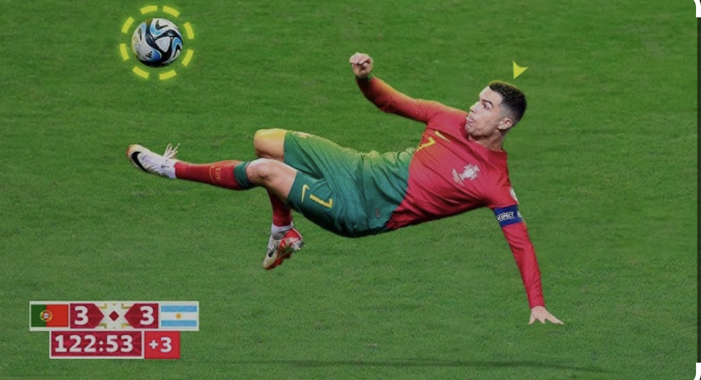

# Welcome to My User Page!

---

## 👨‍🎓 About Me

Hi! I'm **Samson**, a senior Computer Engineering student at **UCSD**.  
I'll be graduating after this quarter, and I'm super excited about starting my engineering career.  
I love building smart systems, solving real-world problems, and learning with friends.

> “Keep pushing. Each bug fixed is one step closer to success.”

---

## ⚽ Football Fan

Outside of engineering, I’m a big fan of **football (soccer)**.  
Watching matches and playing with friends is my favorite way to relax.

---

## 🎯 My Graduation Goals

This quarter is my final step — I’m focused on:
- Completing my senior courses
- Wrapping up my final project
- Applying to engineering jobs and internships

---

## 📸 Favorite Football Moment

*This is my favorite football player and moment!*

---

## 🎉 Fun Facts

- I love football and can name every World Cup winner by heart!
- I enjoy helping friends learn coding and circuits.
- I drink more coffee during finals than the rest of the year ☕😄

---

Thanks for visiting my page!  
[Visit my GitHub here](https://github.com/Samat4E)
